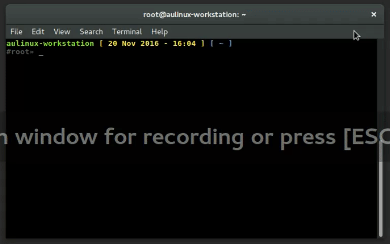

<p align="center">Preview

</p>

# Requirements
This theme is need [oh-my-zsh](https://github.com/robbyrussell/oh-my-zsh) to be used.

# Installation
Donwload the theme
```bash
curl https://raw.githubusercontent.com/farazaulia/zsh-theme/master/faul.zsh-theme > ~/.oh-my-zsh/themes/faul.zsh-theme
```

Then add (or edit) this line as following in you `~/.zshrc` file
```bash
ZSH_THEME="faul"
```

Open new terminal and run this code
```bash
source ~/.zshrc
```
